<h1 align="center"> Da Vinci Code Game </h1>

## 📌 1. 주제
### 📖 주제 설명
다빈치 코드는 상대방의 타일 색상과 숫자를 추측하며 게임을 진행하는 보드게임입니다. 자신이 가진 타일과 공개되지 않은 타일을 기반으로 추리를 진행합니다. 게임에서 자신의 타일이 모두 공개되면 패배합니다.

### 🛠️ 배경 및 동기
- Swing GUI를 활용하여 개발된 프로젝트로, 그래픽 요소인 타일과 선택 알고리즘, 정렬 알고리즘을 명확히 구분했습니다.
- 추가 기능을 포함하여 완성된 게임의 재미와 독창성을 강조했습니다.

### 🎯 기획 의도
- 남녀노소 누구나 즐길 수 있는 보드게임의 특성을 살리며, 온라인 환경에서 시간 및 공간적 제약을 해소했습니다.
- 혼자서도 게임을 즐길 수 있도록 설계했으며, 기존 게임과의 차별화를 꾀했습니다.

---

## 💻 2. 설계
### 🛠️ 2-1 도구 구성도

### 🎮 2-2. 게임 설계 (Game Design)
- **컴퓨터 알고리즘 구현**: 혼자서도 게임이 가능하도록 설계.
- **전적과 랭킹 시스템**: 경쟁 요소를 추가하여 플레이어의 목표의식을 고취.
- **사운드 설정**: 몰입감을 형성하기 위한 적절한 사운드 제공.
- **로그인 및 회원가입 기능**: 유저별 전적 관리 및 개인 데이터 저장.
- **마이페이지**: 개인 전적 조회 및 정보 수정 가능.

### 🎨 2-3 UI 설계

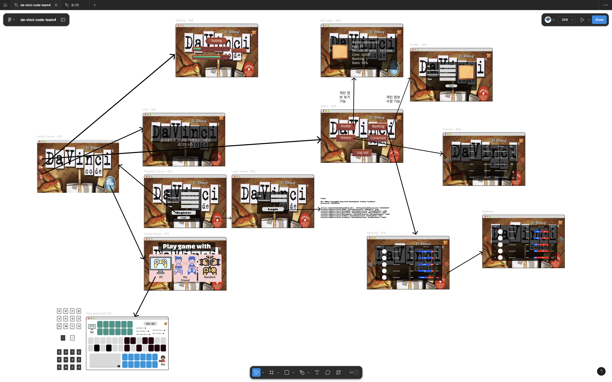

### 🖼️ 2-4. 화면 설계

|                                     **로그인 화면**                                      |                                     **메인 화면**                                     |
|:-----------------------------------------------------------------------------------:|:---------------------------------------------------------------------------------:|
|     [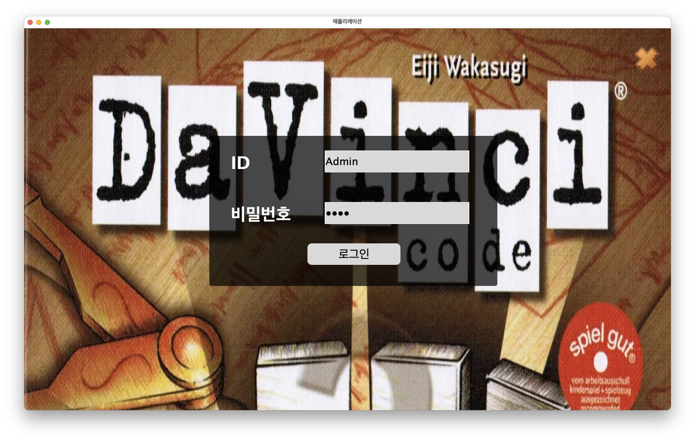](img/login.png)      |       [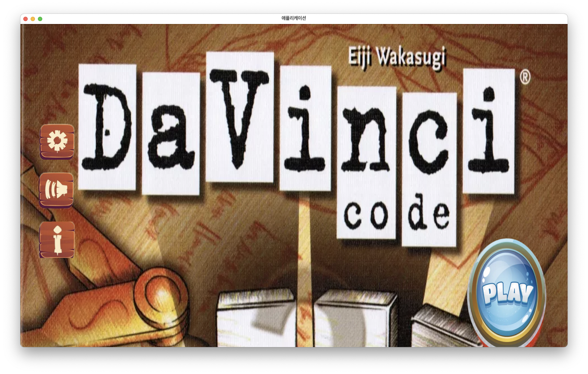](img/home.png)       |
|                                      **메뉴 화면**                                      |                                     **랭킹 화면**                                     |
|       [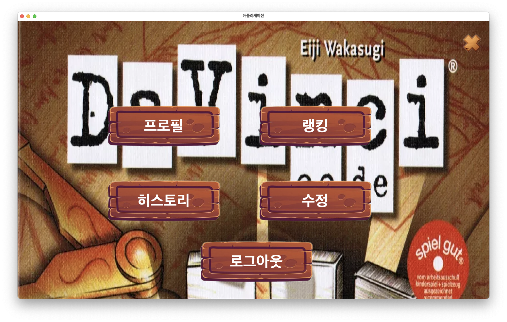](img/Menu.png)       | [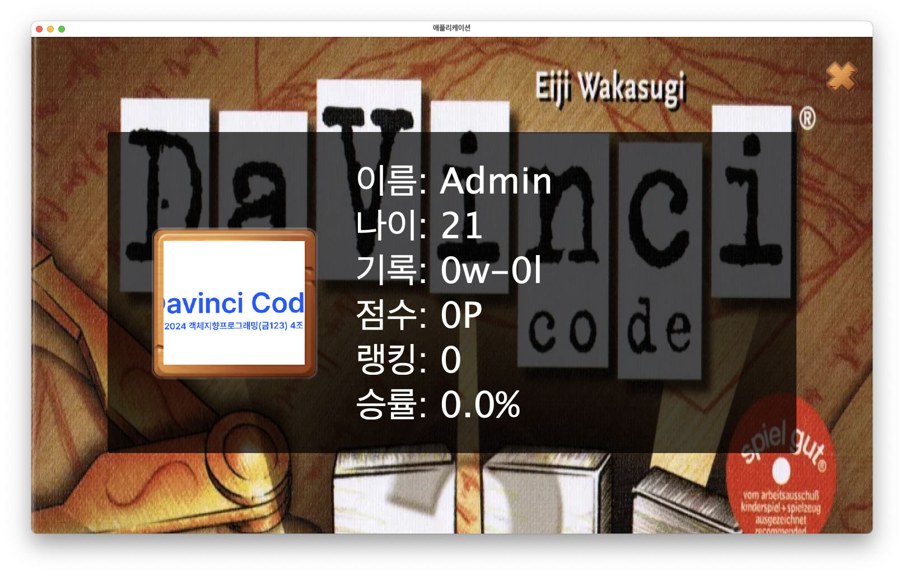](img/profile.png)  |
|                                     **히스토리 화면**                                     |                                     **랭킹 화면**                                     |
|  [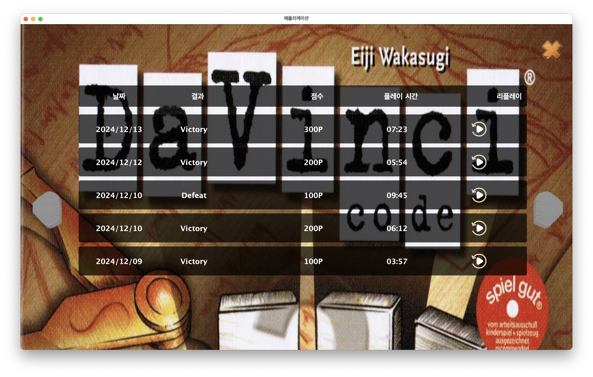](img/history.png)   | [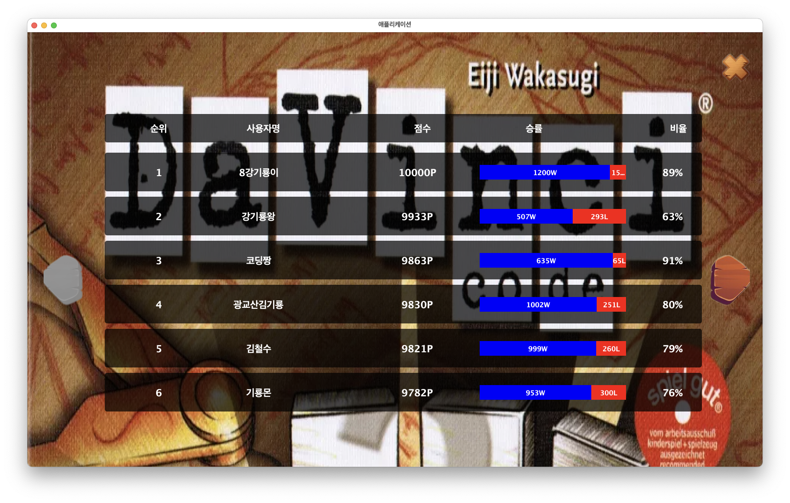](img/ranking.png)  |
|                                **Audio Setting 화면**                                 |                                   **게임 메뉴 화면**                                    |
|     [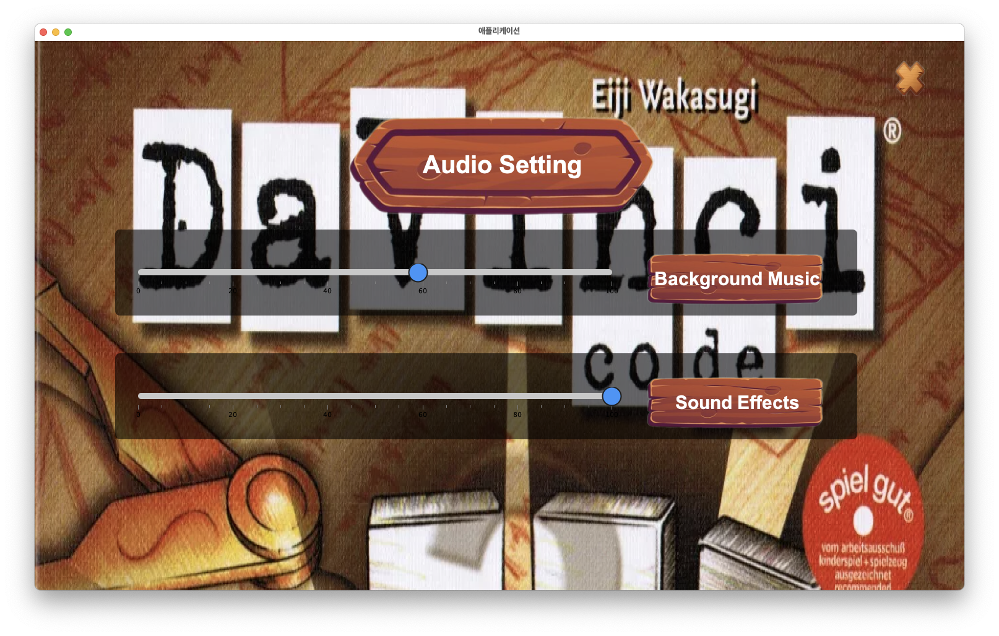](img/audio.png)      | [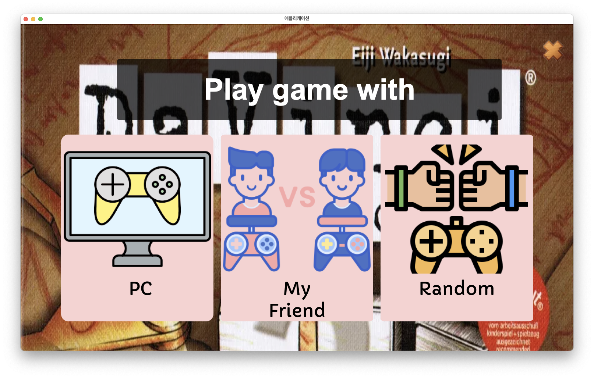](img/maingame.png)  |
|                                    **게임 플레이 화면**                                    |                                  **게임 승리/패배 화면**                                  |
| [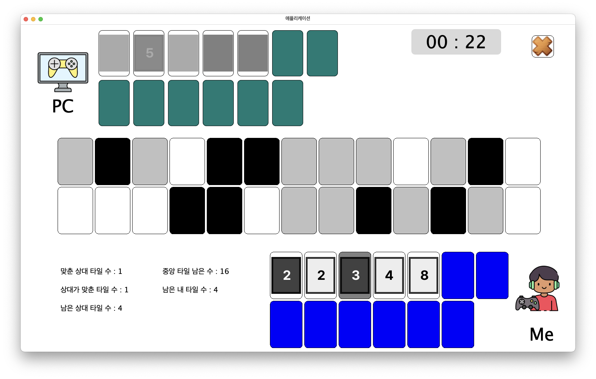](img/playgame.png) | [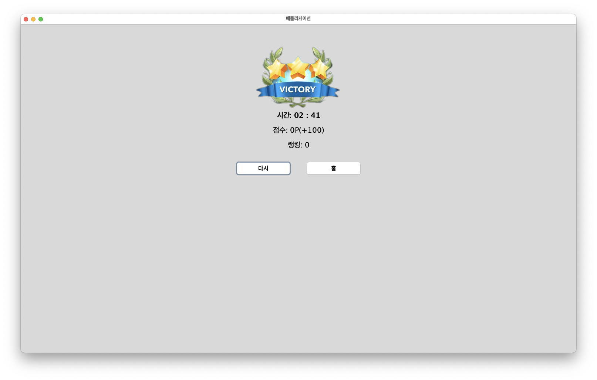](img/Victory.png) |

## 📘 UML 다이어그램

  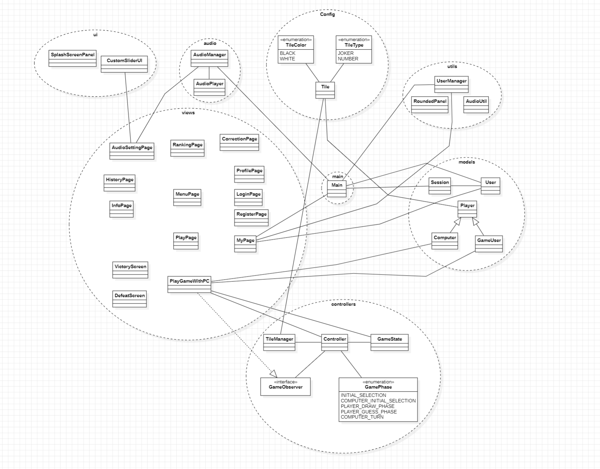

---

## 🧩 3. 점수와 랭킹 처리 방식
### 🏆 점수 처리 방식
- 초기 점수: **0점**으로 시작.
- 승리 시: **+100점** 추가.
- 패배 시: **-100점** 감소.
- 데이터는 `user.txt` 파일에 저장.

### 🥇 랭킹 처리 방식
- 가상 플레이어와 실제 유저의 점수를 기반으로 랭킹 생성.
- 난이도 조정 및 매칭 기능의 확장 가능성 포함.

### 🖼️ 이미지 관리
- 총 50여 개의 타일 및 UI 이미지를 활용, `resources` 디렉토리에서 관리.
- **출처**:
  - 타일 이미지: 직접 제작.
  - 기타 UI 이미지: [freepik.com](https://www.freepik.com).

---

🔗 **더 많은 내용은 [GitHub Repository](https://github.com/da-vinci-code-team4/da-vinci-code-team4)를 참고하세요.**

## 👥 팀명: 4조

<h2> 담당교수: 이은정 교수님 </h2>
<table style="display: contents; justify-content: center; border-collapse: collapse; width: 110%; margin: 0 auto; text-align: center;">
  <tr>
    <th style="width: 20%; border: 1px solid #000;">이름</th>
    <th style="width: 30%; border: 1px solid #000;">전공</th>
    <th style="width: 20%; border: 1px solid #000;">이름</th>
    <th style="width: 30%; border: 1px solid #000;">전공</th>
  </tr>
  <tr>
    <td style="border: 1px solid #000;">최지민*</td>
    <td style="border: 1px solid #000;">컴퓨터공학부</td>
    <td style="border: 1px solid #000;">조항준</td>
    <td style="border: 1px solid #000;">컴퓨터공학전공</td>
  </tr>
  <tr>
    <td style="border: 1px solid #000;">배영빈</td>
    <td style="border: 1px solid #000;">컴퓨터공학전공</td>
    <td style="border: 1px solid #000;">보꾸옥안</td>
    <td style="border: 1px solid #000;">컴퓨터공학전공</td>
  </tr>
  <tr>
    <td style="border: 1px solid #000;">박예원</td>
    <td style="border: 1px solid #000;">컴퓨터공학전공</td>
    <td style="border: 1px solid #000;">양태현</td>
    <td style="border: 1px solid #000;">컴퓨터공학부</td>
</table>

